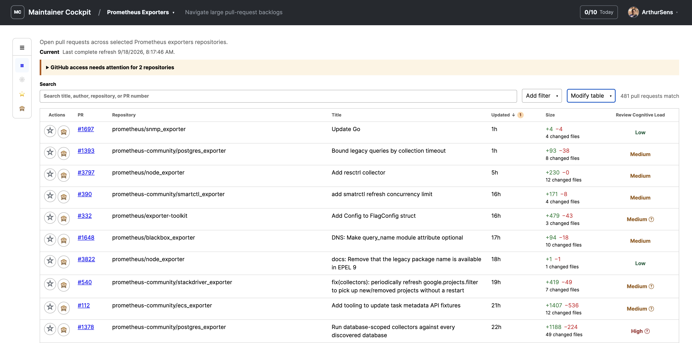

# Maintainer Cockpit

Maintainer Cockpit is a self-hosted dashboard that helps open source
maintainers understand and navigate large GitHub pull-request backlogs.

The current supported release is v0.0.1. Maintainer Cockpit is pre-1.0, so
review the release notes before every upgrade.



## What it does

- collects public pull requests from explicit repository collections;
- presents sortable, filterable GitHub facts without an aggregate priority
  score;
- adds evidence-backed Review Cognitive Load, waiting-on, quality, contribution
  context, and feature-correlation signals;
- preserves incomplete, unknown, stale, and failed states instead of presenting
  partial evidence as complete; and
- provides private maintainer workflows for Important PRs, goals, snooze, and
  ignore.

Maintainer Cockpit supports human judgment. It does not review code, recommend
one “best” pull request, write to repositories, or merge and close pull
requests. Model endpoints are optional and receive no product credentials,
tools, external-URL access, or mutation capability. Personal workflow state is
private to the authenticated maintainer.

## Quick start

Requirements are Docker Engine and GitHub credentials that can read the
configured repositories.

```sh
docker pull ghcr.io/arthursens/maintainer-cockpit:v0.0.1
git clone --branch v0.0.1 --depth 1 \
  https://github.com/ArthurSens/maintainer-cockpit.git
cd maintainer-cockpit
```

Edit `config/maintainer-cockpit.yaml`, replace every example value, and export
the environment variables named by its secret references. The
[installation guide](docs/installation.md) provides the complete validation
and container startup commands for the versioned image.

The application should remain bound to localhost. Configure an
[HTTPS reverse proxy](docs/reverse-proxy.md) before enabling GitHub login or
making the deployment reachable from an untrusted network.

## Documentation

The [documentation index](docs/README.md) routes maintainers, deployment
operators, and contributors by task.

- [Configuration reference](docs/configuration.md)
- [Configure GitHub authentication](docs/github-app.md)
- [Model analysis](docs/model-analysis.md)
- [Deployment operations](docs/operations.md)
- [Troubleshooting](docs/troubleshooting.md)

The docs describe implemented behavior on `main`. Future work belongs in
GitHub Issues or Discussions until the behavior is available and verifiable.

## Community

- [Contributing](CONTRIBUTING.md)
- [Support](SUPPORT.md)
- [Security](SECURITY.md)
- [Governance](GOVERNANCE.md)
- [Release policy](RELEASES.md)
- [Code of Conduct](CODE_OF_CONDUCT.md)
- [Apache License 2.0](LICENSE)
